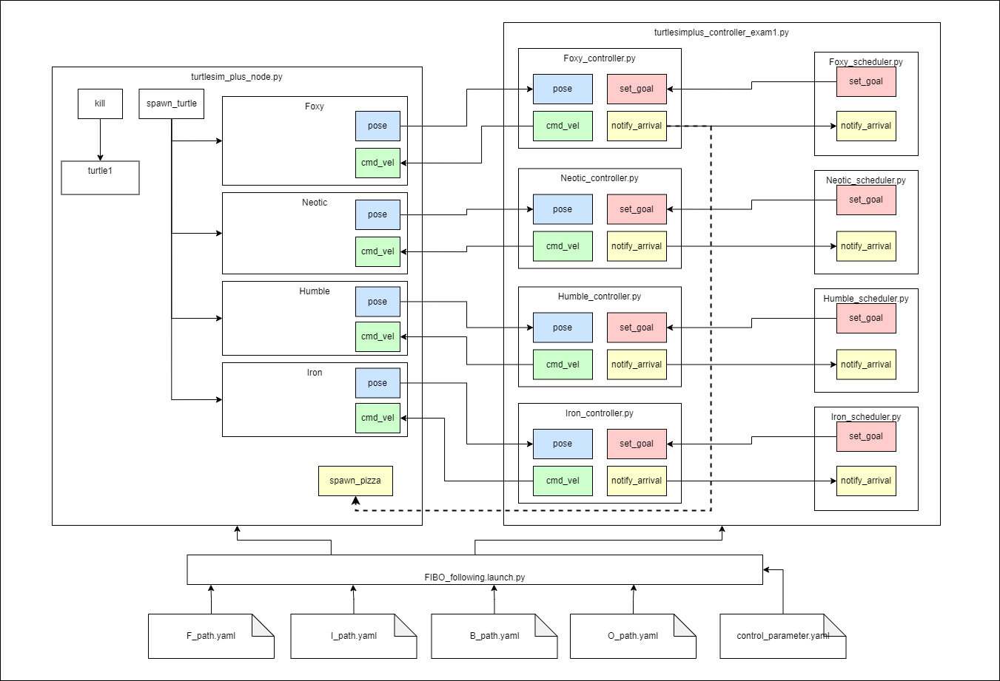

# exam1_turtle_control
## Installation
Step 1: Clone the repo to the src directory of your workspace. You must unzip and put each folder in the src directory.

Step 2: Build "exam1_turtle_control" in your workspace.
```
cd ~/[your_workspace]
colcon build --packages-select exam1_turtle_control
source install/setup.bash
```
## Testing out exam1_turtle_control
Terminal1: run launch file

```
cd ~/[your_workspace]
ros2 launch exam1_turtle_control FIBO_following_launch.py 
```
## System Architecture
<p align="center">
  
</p>

FIBO_following.launch.py can do

1. Launch FIBO_following.launch.py in exam1_turtle_control package to run turtlesim_plus_node, Foxy_controller.py, Noetic_controller.py, Humble_controller.py, Iron_controller.py, Foxy_scheduler.py, Noetic_scheduler.py, Humble_scheduler.py, Iron_scheduler.py
2. When turtlesim_plus_node starts, remove turtle1, then spawn 4 turtles (x=0.1, y=0.1, theta=0, name:Foxy, Noetic, Humble, Iron)
3. Pass a configuration file (control_parameter.yaml) to the controller node as ROS parameters.
{ros__parameters:{linear_gain:5.0, angular_gain:7.0, tolerance:0.1}}
4. Pass the full path to the via point file in the "via_point" directory of the package (F_path.yaml, I_path.yaml, B_path.yaml, O_path.yaml) to the each turtle scheduler.
5. Spawn pizza: use spawn_pizza service in turtlesim_plus package to spawn pizza when the turtle arrived at the goal point.
